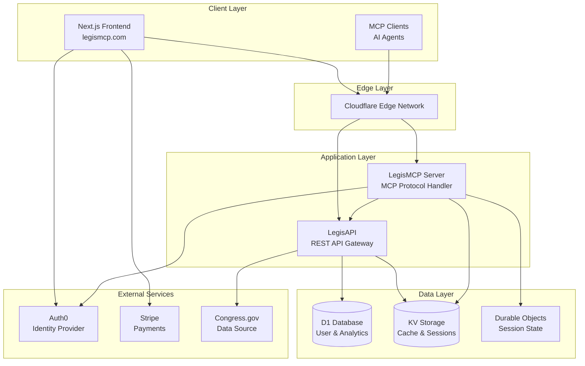
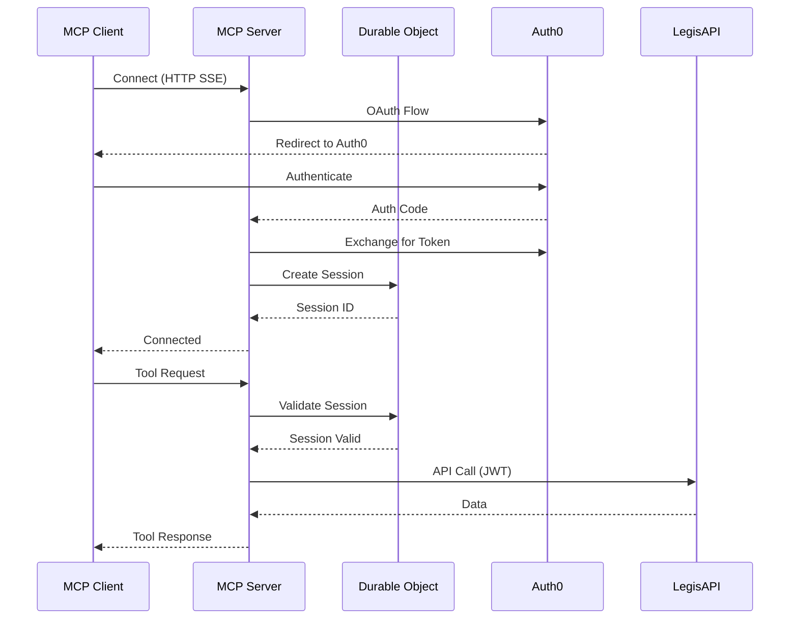
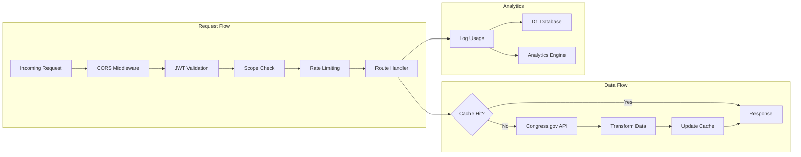
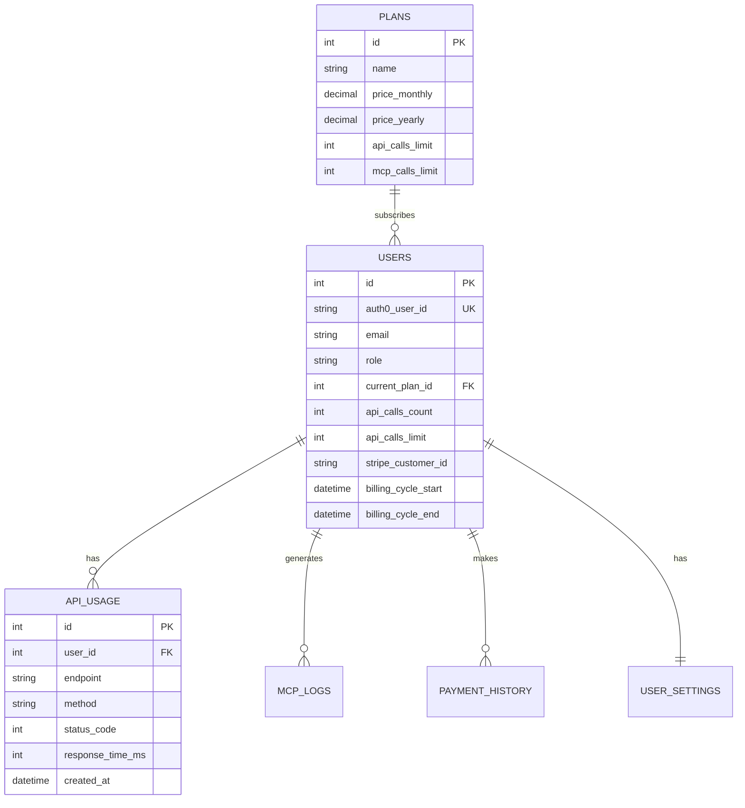
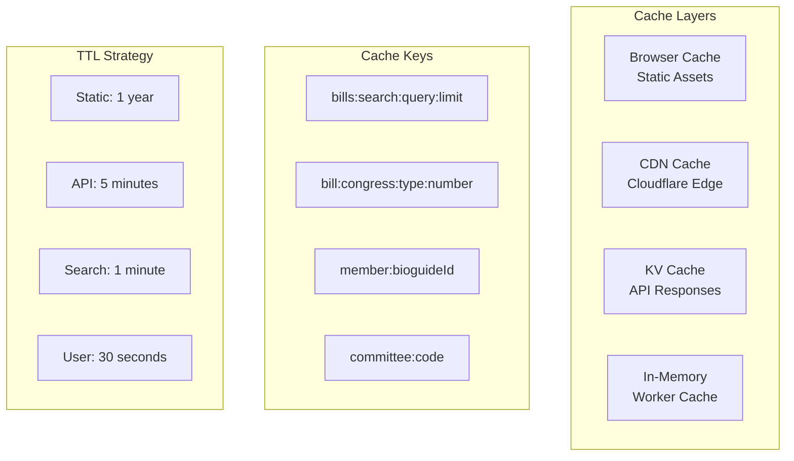
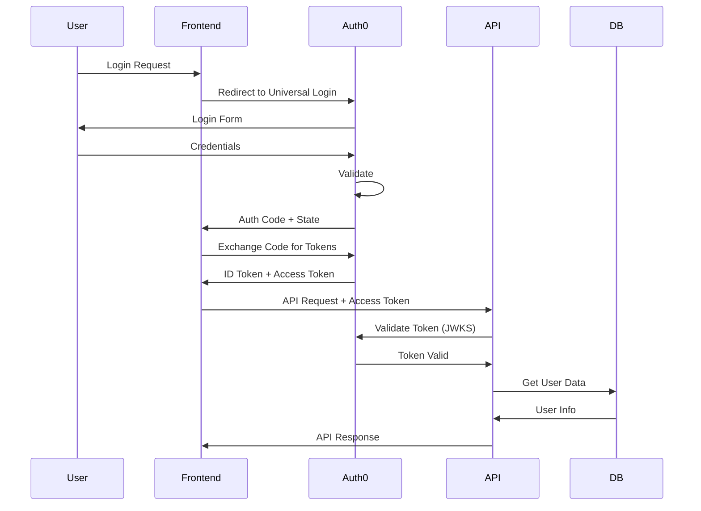
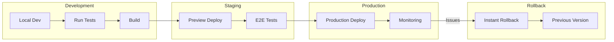
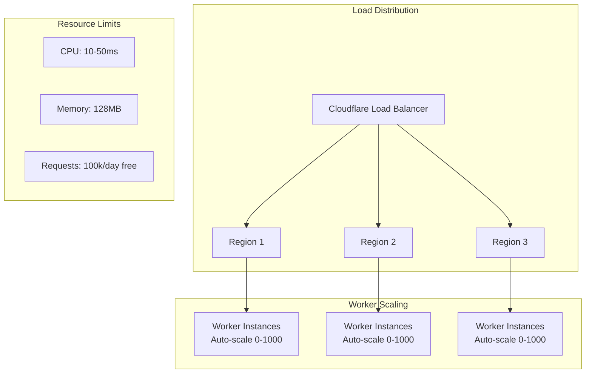
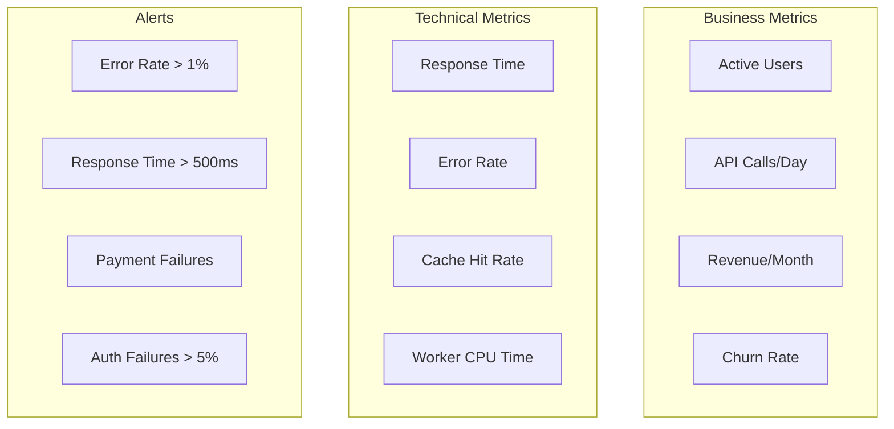
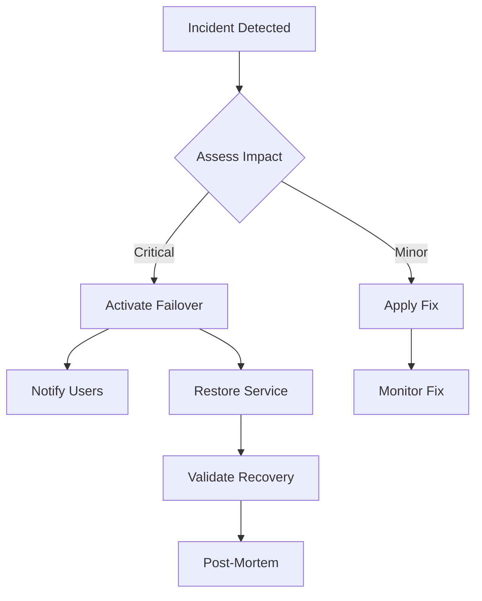

# LegisMCP Architecture Documentation

## System Overview

LegisMCP is a comprehensive legislative data platform built on modern cloud architecture, providing real-time access to U.S. congressional data through multiple interfaces.



## Component Architecture

### 1. Frontend (Next.js 14)

**Technology Stack:**
- Framework: Next.js 14 with App Router
- Authentication: Auth.js (NextAuth) with Auth0
- Payments: Stripe Checkout & Customer Portal
- UI: Radix UI + Tailwind CSS
- Deployment: Vercel

**Key Features:**
- Server-side rendering for SEO
- JWT-based session management
- Real-time subscription status
- Progressive web app capabilities

### 2. LegisMCP Server (MCP Protocol)

**Technology Stack:**
- Runtime: Cloudflare Workers
- Protocol: Model Context Protocol (MCP)
- State: Durable Objects
- Cache: Workers KV
- Auth: OAuth2 with PKCE

**Architecture Diagram:**


### 3. LegisAPI (REST Gateway)

**Technology Stack:**
- Runtime: Cloudflare Workers
- Framework: Hono.js
- Database: Cloudflare D1
- Cache: Workers KV
- Analytics: Cloudflare Analytics Engine

**API Flow:**


## Data Architecture

### Database Schema (D1)



### Caching Strategy



## Security Architecture

### Authentication Flow



### Security Layers

1. **Network Security**
   - Cloudflare DDoS Protection
   - Rate Limiting per IP/User
   - CORS Policy Enforcement
   - TLS 1.3 Encryption

2. **Application Security**
   - JWT Token Validation
   - Scope-based Authorization
   - CSRF Protection
   - Input Sanitization

3. **Data Security**
   - Encrypted at Rest (D1)
   - Encrypted in Transit (TLS)
   - PII Isolation
   - Audit Logging

## Deployment Architecture

### Infrastructure as Code

```yaml
# Cloudflare Resources
Resources:
  Workers:
    - name: legis-api
      routes:
        - pattern: api.example.com/*
      bindings:
        - D1: legis-db
        - KV: CONGRESS_KEYS
        - AE: legis_analytics
    
    - name: legis-mcp
      routes:
        - pattern: mcp.example.com/*
      bindings:
        - DO: AuthenticatedMCP
        - KV: OAUTH_KV
        - AI: @cf/meta/llama-3.1-8b-instruct
  
  Databases:
    - name: legis-db
      migrations:
        - 001_initial_schema.sql
        - 002_add_user_roles.sql
        - 003_add_billing_cycle.sql
        - 004_add_monitoring.sql
```

### CI/CD Pipeline



## Scalability & Performance

### Auto-Scaling Architecture



### Performance Optimizations

1. **Edge Computing**
   - 200+ global edge locations
   - <50ms response times globally
   - Automatic geo-routing

2. **Caching Strategy**
   - Multi-layer caching
   - Intelligent cache invalidation
   - Predictive prefetching

3. **Database Optimization**
   - Read replicas for queries
   - Connection pooling
   - Query optimization

## Monitoring & Observability

### Metrics Dashboard



### Logging Architecture

- **Application Logs**: Cloudflare Logpush
- **Error Tracking**: Sentry Integration
- **Analytics**: Cloudflare Analytics Engine
- **Custom Metrics**: Prometheus Format

## Disaster Recovery

### Backup Strategy

1. **Database Backups**
   - Automated daily backups
   - Point-in-time recovery
   - Cross-region replication

2. **Code Backups**
   - Git version control
   - Automated deployments
   - Instant rollback capability

3. **Configuration Backups**
   - Environment variables in vault
   - Infrastructure as code
   - Documented runbooks

### Recovery Procedures



## Future Architecture

### Planned Enhancements

1. **GraphQL Gateway**
   - Unified data layer
   - Real-time subscriptions
   - Better mobile performance

2. **Event-Driven Architecture**
   - Webhook system
   - Real-time notifications
   - Event sourcing

3. **AI Integration**
   - Natural language queries
   - Predictive analytics
   - Automated insights

4. **Multi-Region Active-Active**
   - Global data replication
   - Regional failover
   - Improved latency

## Architecture Decision Records (ADRs)

### ADR-001: Cloudflare Workers for Backend

**Status**: Accepted  
**Context**: Need serverless, globally distributed backend  
**Decision**: Use Cloudflare Workers instead of traditional servers  
**Consequences**: 
- ✅ Global edge deployment
- ✅ Automatic scaling
- ✅ Cost-effective
- ❌ 128MB memory limit
- ❌ 10ms CPU limit

### ADR-002: MCP Protocol for AI Agents

**Status**: Accepted  
**Context**: Need standardized protocol for AI agent integration  
**Decision**: Implement Model Context Protocol (MCP)  
**Consequences**:
- ✅ Standard protocol
- ✅ Tool-based interface
- ✅ Secure authentication
- ❌ Limited client support
- ❌ Additional complexity

### ADR-003: D1 for User Database

**Status**: Accepted  
**Context**: Need SQL database integrated with Workers  
**Decision**: Use Cloudflare D1 instead of external database  
**Consequences**:
- ✅ No additional latency
- ✅ Automatic replication
- ✅ Cost included
- ❌ SQLite limitations
- ❌ Beta service

## Conclusion

The LegisMCP architecture is designed for:
- **Scalability**: Handle millions of requests
- **Performance**: Sub-100ms global response times
- **Security**: Multi-layer security approach
- **Reliability**: 99.9% uptime SLA
- **Maintainability**: Clear separation of concerns
- **Cost-Effectiveness**: Pay-per-use pricing model

This architecture provides a solid foundation for growth while maintaining flexibility for future enhancements.